# MiniBank — Distributed Fund Transfer & Fraud Detection

Sistem transfer dana terdistribusi dengan deteksi fraud secara real-time menggunakan arsitektur microservices.

---

## Daftar Isi

1. [Cara Menjalankan Aplikasi](#-cara-menjalankan-aplikasi)
2. [Contoh Test: Good Case](#-contoh-test-good-case-transfer-berhasil)
3. [Contoh Test: Negative Case](#-contoh-test-negative-case-transfer-ditolak)
4. [Penjelasan Teknis](#-penjelasan-teknis)

---

## 🚀 Cara Menjalankan Aplikasi

### Prasyarat

| Tool | Versi |
|---|---|
| Java | 25+ |
| Maven | 3.8+ |
| Docker / Podman | Terbaru |

### Langkah 1 — Jalankan Semua (Build + Start)

Cukup satu perintah untuk build semua service dan menjalankan seluruh infrastruktur:

```bash
podman compose up --build
```

> Ini akan otomatis:
> - Build 3 microservice (account, transaction, fraud)
> - Start PostgreSQL, Redis, Elasticsearch
> - Menjalankan **migrasi otomatis** (Hibernate `ddl-auto: update` membuat tabel secara otomatis dari entity Java)
> - Menjalankan **DataSeeder** untuk memasukkan data awal (5 akun + 1 admin)

### Langkah 2 — Pastikan Semua Service Berjalan

```bash
podman ps
```

Semua container harus berstatus **Up**:

| Container | Port | Fungsi |
|---|---|---|
| `minibank-account-service` | 8081 | Manajemen akun + autentikasi |
| `minibank-transaction-service` | 8082 | Proses transfer + rekonsiliasi |
| `minibank-fraud-service` | 8083 | Deteksi fraud + audit trail |
| `minibank-postgres` | 5432 | Database utama |
| `minibank-redis` | 6379 | Cache, distributed lock, streaming |
| `minibank-elasticsearch` | 9200 | Audit trail + pencarian |

### Langkah 3 — Buka Swagger UI

Setiap service punya dokumentasi API interaktif (ada tombol **Authorize** untuk JWT):

| Service | URL |
|---|---|
| Account Service | http://localhost:8081/swagger-ui.html |
| Transaction Service | http://localhost:8082/swagger-ui.html |
| Fraud & Audit Service | http://localhost:8083/swagger-ui.html |

### Akun Default (Seed Data)

| Email | Password | Role |
|---|---|---|
| `admin@minibank.com` | `admin123` | ADMIN |
| `syarif@minibank.com` | `password123` | USER |
| `budi@minibank.com` | `password123` | USER |
| `citra@minibank.com` | `password123` | USER |
| `dian@minibank.com` | `password123` | USER |
| `eka@minibank.com` | `password123` | USER |

### Menghentikan Aplikasi

```bash
# Stop semua container
podman compose down

# Stop + hapus data (reset database, redis, elasticsearch)
podman compose down -v
```

---

## ✅ Contoh Test: Good Case (Transfer Berhasil)

Berikut langkah-langkah untuk melakukan transfer yang sukses dari awal sampai akhir.

### Step 1 — Login sebagai USER

```bash
curl -X POST http://localhost:8081/api/auth/login \
  -H "Content-Type: application/json" \
  -d '{"email":"syarif@minibank.com","password":"password123"}'
```

**Response yang diharapkan** (HTTP 200):
```json
{
  "accessToken": "eyJhbGciOiJIUzI1NiJ9...",
  "refreshToken": "550e8400-e29b-41d4-a716...",
  "tokenType": "Bearer",
  "expiresIn": 86400,
  "role": "USER",
  "accountId": "a1111111-..."
}
```

> 📌 **Simpan** nilai `accessToken` dan `accountId` dari response ini — akan dipakai di step berikutnya.

### Step 2 — Cek Saldo Akun Pengirim

```bash
curl http://localhost:8081/api/accounts/{accountId}/balance \
  -H "Authorization: Bearer {accessToken}"
```

**Response yang diharapkan** (HTTP 200): saldo awal Rp 100.000.000

### Step 3 — Lakukan Transfer

Transfer Rp 1.000.000 ke akun lain (login dulu sebagai Budi untuk mendapatkan `accountId` tujuan, atau gunakan akun Budi langsung):

```bash
curl -X POST http://localhost:8082/api/transfers \
  -H "Content-Type: application/json" \
  -H "Authorization: Bearer {accessToken}" \
  -d '{
    "fromAccountId": "{accountId_syarif}",
    "toAccountId": "{accountId_budi}",
    "amount": 1000000,
    "description": "Bayar makan siang"
  }'
```

**Response yang diharapkan** (HTTP 202 Accepted):
```json
{
  "transactionId": "uuid-transaksi...",
  "referenceNo": "TXN-20260225-XXXXXX",
  "status": "PENDING",
  "fraudCheckStatus": "PENDING",
  "amount": 1000000
}
```

> Transfer berstatus **PENDING** karena diproses secara **asinkron**. Fraud Service akan mengecek transaksi ini via Redis Stream.

### Step 4 — Cek Status Transfer

Tunggu 1-2 detik, lalu cek status:

```bash
curl http://localhost:8082/api/transfers/{transactionId} \
  -H "Authorization: Bearer {accessToken}"
```

**Response yang diharapkan** (HTTP 200):
```json
{
  "transactionId": "uuid-transaksi...",
  "status": "COMPLETED",
  "fraudCheckStatus": "APPROVED",
  "amount": 1000000
}
```

> ✅ Status berubah jadi **COMPLETED** — artinya fraud check lolos dan saldo sudah dipindahkan.

---

## ❌ Contoh Test: Negative Case (Transfer Ditolak)

### Skenario: Transfer Jumlah Besar (Fraud: Large Amount)

Transfer di atas Rp 50.000.000 akan memicu fraud rule **Large Amount** dengan risk score +30.

```bash
curl -X POST http://localhost:8082/api/transfers \
  -H "Content-Type: application/json" \
  -H "Authorization: Bearer {accessToken}" \
  -d '{
    "fromAccountId": "{accountId_syarif}",
    "toAccountId": "{accountId_budi}",
    "amount": 75000000,
    "description": "Transfer besar"
  }'
```

**Response** (HTTP 202): Status PENDING seperti biasa.

Lalu cek status — kemungkinan besar **REJECTED** karena jumlahnya memicu fraud rule. Jika dikombinasikan dengan faktor lain (misalnya transfer di jam 02:00 pagi = +20, atau sudah banyak transfer = +40), total risk score bisa mencapai ≥40 yang menyebabkan **BLOCKED**.

### Skenario: Login dengan Password Salah

```bash
curl -X POST http://localhost:8081/api/auth/login \
  -H "Content-Type: application/json" \
  -d '{"email":"syarif@minibank.com","password":"salah123"}'
```

**Response yang diharapkan** (HTTP 500):
```json
{
  "error": "Internal Server Error",
  "message": "Invalid email or password"
}
```

### Skenario: Akses Endpoint ADMIN tanpa Izin

Login sebagai USER biasa, lalu coba akses endpoint admin:

```bash
curl http://localhost:8081/api/accounts \
  -H "Authorization: Bearer {accessToken_user}"
```

**Response yang diharapkan** (HTTP 403 Forbidden):
```json
{
  "error": "Forbidden"
}
```

> 🔒 Endpoint `GET /api/accounts` (list semua akun) hanya bisa diakses oleh role **ADMIN**.

### Skenario: Akses Tanpa Token

```bash
curl http://localhost:8081/api/accounts
```

**Response yang diharapkan** (HTTP 401 Unauthorized).

---

## 📖 Penjelasan Teknis

### Arsitektur Sistem

```mermaid
flowchart TB
    subgraph services["Microservices"]
        direction LR
        AS["Account Service :8081\n• CRUD Akun\n• Cache Saldo\n• Autentikasi\n• JWT Provider"]
        TS["Transaction Service :8082\n• Proses Transfer\n• Distributed Lock\n• Redis Streams Pub\n• Rekonsiliasi EOD"]
        FS["Fraud & Audit Service :8083\n• Fraud Rules Engine\n• Audit Trail (ES)\n• Redis Stream Sub\n• Full-text Search"]
    end

    subgraph infra["Infrastruktur"]
        direction LR
        PG[("PostgreSQL 16")]
        RD[("Redis 7\nCache + Lock + Streams")]
        ES[("Elasticsearch 8")]
    end

    AS --- PG
    AS --- RD
    TS --- PG
    TS --- RD
    FS --- RD
    FS --- ES
```



### Requirement ↔ Implementasi

| Requirement | Implementasi | Penjelasan |
|---|---|---|
| **Spring IoC** | `@Service`, `@Repository`, `@Component`, `@Configuration` | Inversion of Control — Spring yang mengelola pembuatan dan injeksi objek, bukan kita manual `new`. Detail di bawah. |
| **Spring Security** | JWT + `@PreAuthorize` + `BCryptPasswordEncoder` | Autentikasi berbasis token JWT, otorisasi berdasarkan role (USER/ADMIN), password di-hash pakai BCrypt. |
| **Java Stream** | `.stream().map().filter().collect()` | Untuk transformasi data — misal konversi list entity jadi list DTO, filter transaksi berdasarkan status, dll. |
| **Advanced Native SQL** | `SUM() OVER`, `LAG`, `LEAD`, CTE | Query SQL kompleks untuk rekonsiliasi akhir hari — menghitung running balance, rata-rata saldo harian. |
| **Containerization** | Docker Compose + 3 Spring Boot microservice | Setiap service di-package jadi Docker image sendiri, dijalankan bersamaan via `docker-compose.yml`. |
| **Stream-Based** | Redis Streams (consumer groups, acknowledgment) | Menggantikan Apache Kafka untuk event streaming antar service (transfer request → fraud check → result). |
| **Redis** | Distributed Lock (Redisson), cache, rate limiting | Lock untuk mencegah transfer race condition, cache saldo, rate limiting untuk fraud detection. |
| **Elasticsearch** | Audit trail + full-text search (fuzzy, multi_match) | Menyimpan log audit di Elasticsearch, bisa dicari dengan query teks bebas. |

---

### Penjelasan Anotasi Spring yang Digunakan

#### Layer Anotasi

| Anotasi | Layer | Fungsi |
|---|---|---|
| `@RestController` | Controller | Menandai class sebagai REST API controller. Otomatis mengubah return value jadi JSON. |
| `@Service` | Service / Business Logic | Menandai class sebagai layer bisnis logic. Spring akan otomatis membuat instance-nya (**bean**) dan meng-inject-nya ke class lain yang membutuhkan. Contoh: `AuthService` berisi logic register, login, refresh token. |
| `@Repository` | Data Access | Menandai interface sebagai layer akses data. Spring Data JPA otomatis membuat implementasinya — kita cukup definisikan method signature, Spring yang generate query SQL-nya. |
| `@Component` | General | Menandai class agar dikelola Spring sebagai bean. Dipakai untuk class yang tidak masuk kategori Service/Repository/Controller. Contoh: `DataSeeder`, `JwtAuthenticationFilter`. |
| `@Configuration` | Config | Menandai class sebagai sumber konfigurasi Spring. Method-method di dalamnya yang ditandai `@Bean` akan menghasilkan objek yang dikelola Spring. Contoh: `SecurityConfig` mendefinisikan `PasswordEncoder` dan `SecurityFilterChain`. |

#### Dependency Injection

```java
@Service
@RequiredArgsConstructor  // Lombok — auto-generate constructor
public class AuthService {
    // Spring otomatis inject object-object ini via constructor
    private final UserCredentialRepository userCredentialRepository;
    private final PasswordEncoder passwordEncoder;
    private final JwtUtil jwtUtil;
}
```

**Cara kerja:** Ketika aplikasi start, Spring membuat semua bean (`@Service`, `@Repository`, dll), lalu **otomatis meng-inject** dependensi yang dibutuhkan ke constructor. Kita tidak perlu `new AuthService(...)` secara manual.

#### Anotasi JPA (Database)

| Anotasi | Fungsi |
|---|---|
| `@Entity` | Menandai class Java sebagai tabel di database. |
| `@Table(name = "accounts")` | Menentukan nama tabel di database. |
| `@Id` | Menandai field sebagai primary key. |
| `@GeneratedValue(strategy = GenerationType.UUID)` | Primary key di-generate otomatis sebagai UUID. |
| `@Column(nullable = false, unique = true)` | Konfigurasi kolom — tidak boleh null, harus unik, dll. |
| `@CreationTimestamp` | Otomatis isi timestamp saat record dibuat. |
| `@UpdateTimestamp` | Otomatis update timestamp setiap kali record diubah. |
| `@Transactional` | Semua operasi database di dalam method ini berjalan sebagai satu transaksi — jika ada error, semua di-rollback. |

#### Anotasi Validasi (Request DTO)

| Anotasi | Fungsi | Contoh |
|---|---|---|
| `@NotBlank` | Field tidak boleh kosong | `@NotBlank(message = "Email is required")` |
| `@Email` | Harus format email valid | `@Email(message = "Invalid email format")` |
| `@DecimalMin` | Nilai minimum | `@DecimalMin("10000.00")` — minimal Rp 10.000 |
| `@Size` | Panjang string | `@Size(min = 6)` — password minimal 6 karakter |
| `@Valid` | Aktifkan validasi di controller | `@Valid @RequestBody LoginRequest request` |

#### Anotasi Security

| Anotasi | Fungsi |
|---|---|
| `@EnableWebSecurity` | Mengaktifkan Spring Security di aplikasi. |
| `@Bean SecurityFilterChain` | Mendefinisikan aturan keamanan — endpoint mana yang butuh login, endpoint mana yang publik. |
| `OncePerRequestFilter` | Base class untuk filter yang dijalankan sekali per request — dipakai oleh `JwtAuthenticationFilter` untuk mengecek token JWT di setiap request. |

---

### Alur Transfer Dana (Detail Teknis)


### Fraud Detection Rules

| Rule | Kondisi | Risk Score | Penjelasan |
|---|---|---|---|
| Large Amount | Transfer > Rp 50.000.000 | +30 | Nominal besar berpotensi mencurigakan. |
| High Frequency | > 10 transfer dalam 1 jam | +40 | Menggunakan Redis counter dengan TTL 1 jam. |
| Suspicious Hours | Jam 00:00 - 05:00 | +20 | Transfer di luar jam wajar. |
| Velocity Check | Tujuan yang sama baru-baru ini | +15 | Mengecek apakah ada transfer ke akun yang sama dalam waktu dekat. |

**Keputusan berdasarkan total risk score:**
- **< 40** → ✅ APPROVED (transfer dilanjutkan)
- **40 - 69** → ❌ BLOCKED (transfer ditolak)
- **≥ 70** → ❌ BLOCKED (transfer ditolak)

---

### Role-Based Access Control

| Endpoint | USER | ADMIN | Keterangan |
|---|---|---|---|
| `POST /api/auth/*` | ✅ | ✅ | Login, register, refresh — publik. |
| `POST /api/accounts` | ❌ | ✅ | Hanya admin yang bisa buat akun secara manual. |
| `GET /api/accounts` | ❌ | ✅ | List semua akun — admin only. |
| `GET /api/accounts/{id}` | ✅* | ✅ | *USER hanya bisa lihat akun sendiri. |
| `POST /api/transfers` | ✅ | ✅ | Semua user bisa transfer. |
| `GET /api/reconciliation/**` | ❌ | ✅ | Laporan rekonsiliasi harian — admin only. |
| `GET /api/audit/**` | ❌ | ✅ | Audit trail dan pencarian — admin only. |

---

### Struktur Folder Proyek

```
minibank/
├── docker-compose.yml              # Konfigurasi semua container
│
├── account-service/                 # Service 1: Manajemen Akun + Auth
│   └── src/main/java/com/minibank/account/
│       ├── config/                  # Konfigurasi (DataSeeder, OpenAPI, Redis, Security)
│       ├── controller/              # REST API endpoint
│       ├── dto/                     # Data Transfer Object (request/response)
│       ├── entity/                  # JPA Entity (mapping ke tabel database)
│       ├── repository/              # Interface akses database
│       ├── security/                # JWT filter, Security config
│       └── service/                 # Business logic
│
├── transaction-service/             # Service 2: Transfer + Rekonsiliasi
│   └── src/main/java/com/minibank/transaction/
│       ├── config/                  # Redis, Security, OpenAPI
│       ├── controller/              # Transfer + Reconciliation endpoint
│       ├── dto/                     # Transfer request/response DTO
│       ├── entity/                  # Transaction entity
│       ├── listener/                # Redis Stream listener (consume fraud result)
│       ├── repository/              # Database + native SQL queries
│       ├── security/                # JWT validation
│       └── service/                 # Transfer logic + distributed lock
│
└── fraud-service/                   # Service 3: Fraud Detection + Audit
    └── src/main/java/com/minibank/fraud/
        ├── config/                  # Redis Stream, Elasticsearch, Security
        ├── controller/              # Audit search endpoint
        ├── document/                # Elasticsearch document (AuditLog)
        ├── listener/                # Redis Stream listener (consume transfer events)
        ├── repository/              # Elasticsearch repository
        ├── security/                # JWT validation
        └── service/                 # Fraud rules engine
```

---

### Rekonsiliasi Akhir Hari (EOD)

```bash
# Contoh: laporan rekonsiliasi tanggal 25 Feb 2026
curl http://localhost:8082/api/reconciliation/daily?date=2026-02-25 \
  -H "Authorization: Bearer {accessToken_admin}"
```

Menggunakan **Advanced Native SQL**:

- **`SUM() OVER (PARTITION BY account_id ORDER BY created_at)`** — menghitung running balance per akun
- **`LAG()` / `LEAD()`** — melihat transaksi sebelumnya / berikutnya
- **`CTE (WITH clause)`** — menghitung rata-rata saldo harian per akun
